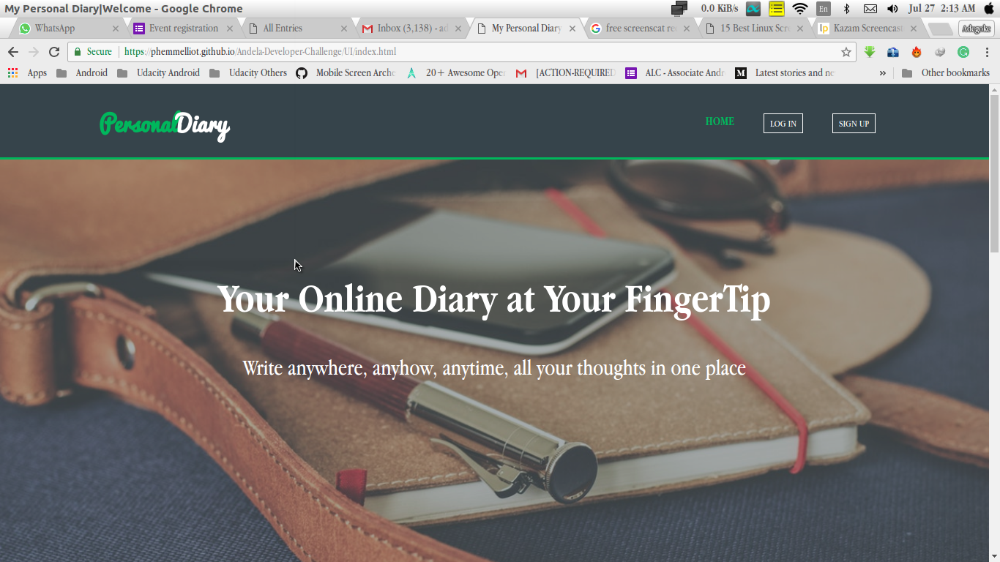

# Andela-Developer-Challenge - My Diary



> My diary is a webapp where users can input there thoughts, anytime, anywhere

[](https://travis-ci.com/phemmelliot/Andela-Developer-Challenge)
[](https://coveralls.io/github/phemmelliot/Andela-Developer-Challenge?branch=bug-fix-travis-coveralls)
 [](https://codeclimate.com/github/phemmelliot/Andela-Developer-Challenge/maintainability) [](https://codeclimate.com/github/phemmelliot/Andela-Developer-Challenge/test_coverage)


***Feel the User Experience***


## Table of Contents (Optional)

- [Usage](#usage)
- [Features](#features)
- [Contributing](#contributing)
- [Team](#team)
- [Testing](#testing)
- [License](#license)


## Usage

### Developers
- For developers seeking to use it as a backend infrastructure use this url as your base url https://phemmelliotdiary.herokuapp.com/v1 and then follow the description in [Usage](#usage) below to get started on how to implement the api endpoints in your app.    

### Other users
   Simply visit this https://phemmelliot.github.io/Andela-Developer-Challenge/UI/index.html to get started on using the services provided on the website.


## Features
  Add to Base URL above
- To create new entry use `POST /entries`, a successful response will be
     ```javascript
      { status: '200', message: 'Entry Uploaded Successfully' }
     ```
     and an unsuccessful response will be
     ```javascript
     { status: 400, message: 'Bad Request', description: 'Body or title cannot be empty' }
     ```
- To Update an entry use `PUT /entries/id`, where id is the id of entry to be updated, a successful response will be
     ```javascript
     { status: '200', message: 'Entry Modified Successfully' }
     ```
     and an unsuccessful response will be
     ```javascript
     { status: 400, message: 'Bad Request' }
     ```
- To get all entries use `GET /entries`
     a sample successful response will be
     ```javascript
     { entries: [], size: 0 }
     ```
     and an unsuccessful response will be
     ```javascript
     { status: 400, message: 'Bad Request' }
     ```
- To get one entry use `GET /entries/id`
     a sample successful response will be
     ```javascript
     { title: 'Here is the title', text: 'Here is content of an entry' }
     ```
     and an unsuccessful response will be
     ```javascript
     { status: 400, message: 'Bad Request', description: 'Entry does not exist' }
     ```
- To delete an entry use `DELETE /entries/id`
     a successful response will be
     ```javascript
     { status: '200', message: 'Entry Deleted Successfully' }
     ```
     and an unsuccessful response will be
     ```javascript
     { status: 400, message: 'Bad Request', description: 'Entry does not exist' }
     ```


## Contributing
    I would love to hear from anyone willing to contribute

## Team
   For now i am the only working on this, but what i am learning to build here i am
   learning it with some awesome folks facilitated by another awesome folk.
## Testing
   If you want naive test, you can just use `postman` to test, but real test, clone the repository, open terminal in root and do the following on terminal
   ```shell
   $ npm install
   ```
      Followed by

  ```shell
  $ npm test
  ```
## License
  None for now.
